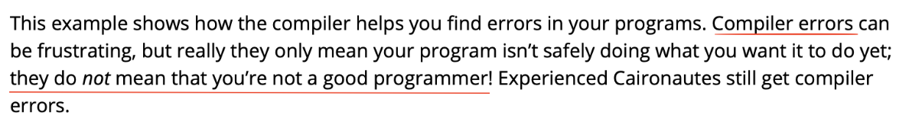

## Введение

### Отличия между Ethereum Mainnet и StarkNet L2

#### Теоретическое изучение:

Существует L1 и L2 Сети:
- **L1 (Layer 1)** - это основные блокчейн-сети, такие как Ethereum Mainnet. 
- **L2 (Layer 2)** - это вторичные сети, построенные поверх L1 блокчейнов.

**Rollups** - вид L2. Есть два основных типа Rollups:
- **Optimistic Rollups**: Они предполагают, что транзакции действительны, до тех пор пока не будет доказано обратное. 
- **zk-Rollups**: Используют технологию zero-knowledge proofs для подтверждения валидности транзакций до их агрегирования.

**StarkNet** – это пример реализации технологии zk-Rollups.


### Описание архитектуры и работы сети StarkNet

#### Теоретическое изучение:

- **Исследование архитектуры StarkNet.**
  StarkNet использует zero-knowledge proofs для подтверждения валидности транзакций, что позволяет обеспечить конфиденциальность и сократить нагрузку на Ethereum Mainnet.

- **Понимание механизма zkSTARK и его преимуществ.**
  zkSTARK обеспечивает возможность подтверждения валидности транзакций без раскрытия конкретных данных, лежащих в их основе.

#### Анализ работы сети:

- **Изучение способов обработки транзакций и смарт-контрактов в StarkNet.**
  Смарт-контракты на Cairo компилируются в байт-код, оптимизированный для работы с StarkNet, что позволяет снизить затраты на газ в Ethereum Mainnet.

### Исполнение смарт-контрактов в StarkNet

1. **Разработка и компиляция смарт-контрактов**: Смарт-контракты пишутся на языке программирования Cairo, предназначенном специально для StarkNet. После написания, контракты компилируются в оптимизированный байт-код, который "понимает" виртуальная машина StarkNet.

2. **Исполнение транзакций**: Транзакции, которые взаимодействуют с контрактами на Cairo, обрабатываются внутри инфраструктуры StarkNet. Система использует алгоритмы zk-STARK для генерации доказательств о валидности этих транзакций без необходимости раскрывать исходные данные.

3. **Агрегирование и подтверждение транзакций**: После обработки, транзакции группируются вместе и агрегируются в одно доказательство zk-STARK, которое затем отправляется в Ethereum Mainnet. Еще раз - это позволяет верифицировать множество транзакций одним запросом, значительно уменьшая расходы на газ и облегчая нагрузку на основную сеть.

## Изучение языка программирования Cairo:

### Основы Cairo:
- Изучение синтаксиса и особенностей Cairo.
- Разработка базовых программ на Cairo для понимания языка.

### Продвинутое Изучение:
- Создание более сложных контрактов с использованием Cairo.

### Материалы:
Для изучения языка были исследованы следующие материалы:
- [Основной учебник по Cairo](https://book.cairo-lang.org) (где описан весь необходимый синтаксис языка).
*Ободряющие приколы из книги с кодом☺️😄*

- [Начало работы со StarkNet](https://book.starknet.io/ch01-00-getting-started.html).
- [Документация по плагинам Remix](https://remix-plugin-docs.readthedocs.io/en/latest/).

### Инструменты разработки:
Разработка велась в [Remix IDE](https://remix.ethereum.org) с подключенным плагином StarkNet. Можно в браузере, но удобнее исполльзовать десктопную версию, хотя она очень часто подвисает и крашится. 

### Полезные моменты и фишки языка:
- **Для тестирования**: аннотация `#[test]` для тестовых функций и команду `scarb test` для их запуска.
- **Изменяемые и неизменяемые значения**: В Cairo все значения по умолчанию неизменяемые, но есть возможность работать и с изменяемыми.
- **Типы данных**: `felt252` — типп по умолчанию, еще это основной целочисленный тип, но есть и другие обозначения для целых чисел.
- **Именование функций**: Используется snake case для объявления функций.
- **Строки**: Для работы со строками используется тип `ByteArray`.
- **Массивы**: В Cairo они представляют собой очереди — добавление в конец и удаление с начала.
- **Передача по ссылке**: Для передачи значения по ссылке используется символ `@`, а для изменяемых ссылок — `ref`.
- **Методы структур**: Для объявления методов структуры сначала нужно определить трейт с сигнатурами методов, а затем — блок `impl` с их реализацией.
- **Модули**: Чтобы объявить модуль в другом файле, нужно создать файл с его названием и поместить его в соответствующую папку.

### Работа со смарт-контрактами:
- **Определение контракта**: Используется атрибут `#[contract]`.
- **Хранение данных**: Данные контракта хранятся в структуре с аннотацией `#[storage]`.
- **Конструкторы**: Для инициализации контракта используется аннотация `#[constructor]`.
- **Публичные функции**: Для их объявления применяется `#[abi(embed_v0)]`.
- **Внешние и просмотровые функции**: External functions изменяют состояние контракта, а View functions только читают данные.
- **События**: Для их объявления используется `#[derive(starknet::Event)]`, а для инициации — `self.emit`.

### Из контракта в компонент:
- **Переход к компоненту**: Добавляем атрибуты `#[starknet::component]` и `#[embeddable_as(name)]`, а также меняем тип аргументов функций на `ComponentState<TContractState>`.

# Практика

В качестве темы проекта был взят демонстрационный контракт.
Но для начала были разработаны примеры для знакомства с Cario - простая программа, простой контракт и сложный контракт.

## 1. Простая программа на Cairo

В рамках этой части была написана обычная программа на cairo(не смарт контракт!).
Для проверки работоспособности было написано несколько типов тестов:

- Обычный single-file тест
- Интеграционный тест

## 1.1 Обычный single-file тест

[еще один полезный ресурс с короткими туториалами по cairo](https://docs.swmansion.com/scarb/docs/cheatsheet.html)

### Необходимые компоненты и установка:
Чтобы настроить среду для работы с Cairo, были выполнены следующие шаги:
````
 brew install rustup
 curl -sL https://raw.githubusercontent.com/lambdaclass/cairo-by-example/main/build/installer.sh | bash -s 2.2.0
 export CARGO_MANIFEST_DIR=/opt/homebrew/Cellar/cairo-lang@2.2.0/2.2.0/corelib
````
### Запуск программы на Cairo:
Чтобы успешно запустить простую программу на Cairo (для примера возьмем поиск НОД), достаточно создать файл [simple_program.cairo](https://github.com/lizashcherbakova/cairo_investigation/blob/main/cairo_programs/simple_program.cairo)
 и запустить следующую команду:
````
cairo-run --single-file  1/simple_program/simple_program.cairo --available-gas=100000
````
Чтобы запустить программу на Cairo без ошибок, надо указать количество газа, доступное для выполнения программы, с помощью опции *--available-gas*. Вообще газ нужен, чтобы ограничивать ресурсы, предоставляемые для выполнения программы, предотвращая её бесконечный запуск.

*Вывод программы:*
````
[DEBUG]	                              	(raw: 0x7

Run completed successfully, returning []
Remaining gas: 65030
````

### Объяснение кода файла simple_program.cairo:
Для написания и иногда тестирования кода я использовала онлайн-редактор [Remix](https://remix.ethereum.org/#lang=en&optimize=false&runs=200&evmVersion=null&version=soljson-v0.8.22+commit.4fc1097e.js) с установленным плагином StarkNet. Так легче компилировать и деплоить смарт-контракты прямо в браузере.

#### Импорты
```cairo
use debug::PrintTrait;
```
Ключевое слово use используется для импорта трейта PrintTrait из библиотеки debug. Этот трейт предоставляет метод .print(), который можно использовать для вывода значений в целях отладки.
Благодаря этому методу в консоль вывелась следующая строка:
````
[DEBUG]	                              	(raw: 0x7
````
`raw: 0x7` педставляет собой число ответ(см. дальше *Разбор вывода*). Выводится в 16-ом виде.

#### Объявление функции НОД
````
fn gcd(number1_ptr: @u8, number2_ptr: @u8) -> u8 {
    ...
}
````
- fn: Это ключевое слово используется для определения функции.
- gcd: Имя функции. Для примера взято нахождение наибольшего общего делителя.
- (number1_ptr: @u8, number2_ptr: @u8): Список параметров функции. @u8 означает, что параметры являются неизменяемыми ссылками на значения типа u8 (беззнаковые 8-битные целые числа).
-> u8: Тип возвращаемого значения функции, в данном случае u8.

#### Тело Функции
````
let number1 = *number1_ptr;
let number2 = *number2_ptr;
let common_divisor = if number1 == number2 {
    number1
} else if number1 > number2 {
    let diff = number1 - number2;
    gcd(@diff, number2_ptr)
} else {
    let diff = number2 - number1;
    gcd(number1_ptr, @diff)
};
common_divisor
````
- let: Используется для объявления переменных.
- number1, number2: Локальные переменные, которые получают значения из ссылок.
- *: Оператор разыменования, используемый для получения значения по ссылке.
- if: Ключевое слово для условного выражения.
- common_divisor: Переменная для хранения общего делителя. Значение в него получается через тернарный оператор.
- В последней строчке точка с запятой не ставится, потому что таким образом функция понимает, что это значение надо вернуть.

#### Главная Функция
````
fn main() {
    ...
}
````
Главная функция программы, которая исполняется первой при запуске.
#### Использование Функции gcd
````
let a = 56;
let b = 21;
let common_divisor: u8 = gcd(@a, @b);
common_divisor.print();
````
- Переменные a и b инициализируются значениями, для которых нужно найти НОД.
- Функция gcd вызывается с ссылками на a и b.
- Результат работы функции gcd выводится с помощью метода .print().

#### Разбор вывода

Вывод `[DEBUG] (raw: 0x7` говорит о том, что функция print() была вызвана для вывода значения, и значение ответа = 7 в шестнадцатеричной системе счисления (0x7), что соответствует 7 в десятичной системе счисления.

Строка `Run completed successfully, returning []` указывает, что выполнение программы завершилось успешно и никакие значения не были возвращены (отсутствие элементов в массиве []).

`Remaining gas: 65030` означает, что после выполнения программы осталось 65030 единиц газа. В контексте блокчейна и смарт-контрактов, "газ" используется для измерения количества вычислительных ресурсов, которые были потреблены программой

## 1.2 Интеграционный тест
### Инструменты и подготовка
[Подрбнее об организации интеграционного тестирования](https://book.cairo-lang.org/ch09-02-test-organization.html)

Для начала использовался инструмент **scarb**. [туториал по использованию](https://docs.swmansion.com/scarb/docs/cheatsheet.html). Установка через homebrew
### Настройка scarb для работы
Чтобы начать работу с **scarb**, необходимо выполнить следующие шаги:

Командой 
```
scarb new test_prj
```
Это создаст новый каталог и проект с названием `test_prj`
В папке `test_prj` Scarb сгенерировал для нас два файла и один каталог: файл Scarb.toml и каталог src с файлом `lib.cairo` внутри.
Также был инициализирован новый репозиторий Git вместе с файлом `.gitignore`

Структура проекта Scarb:

├── Scarb.toml

├── src

│   ├── lib.cairo

│   └── test_prj.cairo

Эта структура подходит для обычных проектов смарт-контрактов. Для интеграционного тестирования надо получить такое:
test_prj

├── Scarb.toml

├── src

│   ├── lib.cairo

│   ├── simple_program_test.cairo

│   ├── tests

│   │   └── integration_test.cairo

│   └── tests.cairo

### Объяснение файлов:
#### Scarb.toml
Этот файл, который является форматом конфигурации для Scarb.

#### src/lib.cairo
Тут перечисляются названия модулей, которые будут компилироваться. Но можно и просто писать код. 
Для тестов пишем тут также тестовую функцию, а модули перечисляются с аннотацией #[cfg(tests)].
В модуле мы ссылаемся на модуль `src/tests.cairo` 
Модуль с интеграционными тестами объявляем в `src/tests.cairo`.
#### src/tests/integration_test.cairo
Тут пишутся сами интеграционные тесты. Сначала, с помощью use, мы импортируем функцию, которую писали в src/lib.cairo. Затем ниже пишем тест, который проверяет эту функцию. Эта функция должна быть с аннотацией #[test].

### Сборка и прогон проекта Scarb
```
cd test_prj
scarb test -f integration_tests
```

## 2. Простой контракт на Cairo
### Объяснение файла Scarb.toml:

Файл `Scarb.toml` служит конфигурационным файлом для проекта, написанного на языке программирования Cairo. Он используется утилитой Scarb, которая управляет зависимостями и сборкой проекта.

**[package]**

**name = "simple_contract"** # Имя пакета (проекта)

**version = "0.1.0"**        # Версия пакета

**[dependencies]**

**starknet = ">=2.3.1"**    # Зависимости пакета, в данном случае starknet версии 2.3.1 или выше

**[[target.starknet-contract]]** # Указывает, что мы будем разрабатывать именно контракты. 

### Объяснение файла src/lib.cairo:
Файл `src/lib.cairo` представляет собой точку входа для компиляции модуля Cairo. В данном случае он содержит только один модуль:

**mod SimpleProgram;** # Объявление модуля SimpleProgram, который будет скомпилирован

### Объяснение кода файла src/SimpleProgram.cairo:

Файл `src/SimpleProgram.cairo` содержит исходный код смарт-контракта для StarkNet

Определение интерфейса смарт-контракта с методами set и get
````
#[starknet::interface]
trait ISimpleProgram<TContractState> {
    ...
}
````
Объявление модуля смарт-контракта с использованием аннотации #[starknet::contract]
````
#[starknet::contract]
mod SimpleProgram {
````

Определение структуры хранения данных контракта. Она должна быть помечена аннотацией #[storage].
ContractState - тип в Cairo, который представляет собой структуру данных, которая содержит всю информацию о состоянии контракта - структура будет включать в себя переменные, объявленные в секции #[storage]
```` 
    #[storage]
    struct Storage {
        a: u128, 
        b: u128
    }
````
Реализация интерфейса ISimpleProgram для контракта.
#[abi(embed_v0)] - это атрибут, который указывает компилятору Cairo, что методы, определенные внутри следующего за ним блока impl, должны быть доступны для вызова извне как часть ABI (Application Binary Interface) контракта.
````
    #[abi(embed_v0)]
    impl SimpleProgram of super::ISimpleProgram<ContractState> {
````
Метод set для установки значений переменных a и b.
ref self: ContractState используется в функциях, которые могут изменять состояние контракта
````
        fn set(ref self: ContractState, x: u128, y: u128) {
            self.a.write(x);
            self.b.write(y);
        }
````
Метод get_a для получения значения переменной a. self: 
@ContractState используется для функций, которые только читают данные из состояния контракта и не изменяют его. 
````
        fn get_a(self: @ContractState) -> u128 {
            self.a.read()
        }
````
## Деплой контракта
### Способ 1 - Remix EDA
В web версии. [Подробный туториал](https://book.starknet.io/ch01-00-getting-started.html)
### Способ 2 - Katana
1. Установить необходимые инструменты:
````
curl -L https://install.dojoengine.org | bash
dojoup -v 0.4.4
starkliup -v 0.1.20
````
**Важно установить такие версии. При несовпадении контракт нельзя будет задеплоить!**
2. Создать .env фалй в src/
````
export STARKNET_ACCOUNT=katana-0
export STARKNET_RPC=http://0.0.0.0:5050
````
Выполнить команду
````
source src/.env
````
3. Собрать проект
````
scarb build
````
Резульат компиляци - .json класса в target/dev/
4. Запускаем локальную сеть katana
````
katana
````
Можно также указать количество аккаунтов, сид и количество газа:
````
katana --accounts 3 --seed 0 --gas-price 250
````
Вывод:
````
PREFUNDED ACCOUNTS
==================

| Account address |  0x03ee9e18edc71a6df30ac3aca2e0b02a198fbce19b7480a63a0d71cbd76652e0
| Private key     |  0x0300001800000000300000180000000000030000000000003006001800006600
| Public key      |  0x01b7b37a580d91bc3ad4f9933ed61f3a395e0e51c9dd5553323b8ca3942bb44e

| Account address |  0x033c627a3e5213790e246a917770ce23d7e562baa5b4d2917c23b1be6d91961c
| Private key     |  0x0333803103001800039980190300d206608b0070db0012135bd1fb5f6282170b
| Public key      |  0x04486e2308ef3513531042acb8ead377b887af16bd4cdd8149812dfef1ba924d

| Account address |  0x01d98d835e43b032254ffbef0f150c5606fa9c5c9310b1fae370ab956a7919f5
| Private key     |  0x07ca856005bee0329def368d34a6711b2d95b09ef9740ebf2c7c7e3b16c1ca9c
| Public key      |  0x07006c42b1cfc8bd45710646a0bb3534b182e83c313c7bc88ecf33b53ba4bcbc
````
5. В другом терминале можем создать аккаунт для декларации и деплоя контракта - signer:
````
starkli signer keystore from-key keys/account0_keystore.json
````
Нас попросят ввести приватный ключ - его надо взять из одного из сгенерированных аккаунтов katana.

Также надо будет придумать пароль.

6. Далее необходимо создать Account Descriptor:
````
starkli account fetch <KATANA ACCOUNT ADDRESS> --rpc http://0.0.0.0:5050 --output keys/account0_account.json
````
KATANA ACCOUNT ADDRESS берем с того же аккаунта, с которого брали приватный ключ.
7. Декларируем контракт
````
starkli declare <Путь до скомпилированного json> --rpc http://0.0.0.0:5050 --account keys/account0_account.json --keystore keys/account0_keystore.json
````
В выводе будет хеш класса.
8. Деплоим контракт
````
starkli deploy <Хеш класса> <Параметры конструктора> --rpc http://0.0.0.0:5050 --account keys/account0_account.json --keystore keys/account0_keystore.json
````
В выводе будет адрес контракта.
9. Вызываем методы для чтения
Для них используется функция call. 
````
starkli call <Адрес контракта> get_a --rpc http://0.0.0.0:5050
````
Для методов чтения также не нужен signer.
11. Вызываем методы, которые изменяют состояние контракта
Для изменения состояния нужно использовать функцию invoke, а также необходим signer.
````
starkli invoke <Адрес контракта> set <Параметры функции> --rpc http://0.0.0.0:5050 --account keys/account0_account.json --keystore keys/account0_keystore.json
````
### Способ 3 - TestNet Bravos
1. Создать кошелек в MetaMask.
- Установить Chrome
- Установить расширение MetaMask
- Зарегистрировать кошелек
2. Зарегистрироваться на следующих ресурсах:
- [Alchemy's Sepolia Faucet](https://sepoliafaucet.com/)
- [Infura's Sepolia Faucet](https://www.infura.io/faucet/sepolia) 
3. Получить с них $ETH в тестовой сети Ethereum Sepolia на кошелек MetaMask.
4. Скачать расширение Braavos и зарегистрировать StarkNet кошелек
5. Перевести с кошелька MetaMask на кошелек Braavos с помощью [Bridge Contract](https://sepolia.etherscan.io/address/0x8453FC6Cd1bCfE8D4dFC069C400B433054d47bDc#writeProxyContract):
- В контракте надо присоединить свой кошелек MetaMask с помощью кнопки *Connect to Web3* **(Это можно сделать только в том браузере, где уже установлено расширение и выполнен вход в MetaMask!)**
- Выбрать функцию `deposit (Oxe2bbb158)`
- В поле `deposit` написать 0.031
- В поле `amount`написать 30000000000000000 *(Пояснение: 1 ETH = 1000000000000000000 (18 decimals))*
- В поле `l2Recipient` написать адрес кошелька Bravos. **(Важно! Нужен адрес кошелька именно в сети Starknet Sepolia)**
6. Перейти в Remix EDA во вкладку `StarkNet` -> `Environment` -> `Environment selection`-> `Wallet`

## 3. Сложный контракт на Cairo

### Объяснение кода файла src/Duck.cairo:

Этот контракт представляет собой простую модель утки, позволяющую устанавливать информацию о ней и издавать кряканье.
- set_duck_details: Функция для установки деталей утки, включая пол (gender) и имя (name).
- quack: Функция, позволяющая утке издавать кряканье.
- get_duck_details: Функция для получения деталей утки, возвращает пол и имя.

Перечисление событий контракта, содержит событие DuckQuacked, которое вызывается при кряканье утки.
````
#[event]
#[derive(Drop, starknet::Event)]
enum Event {
    DuckQuacked: DuckQuacked,
}
````
Событие, содержащее адрес крякающей утки (quacker), сообщение (message) и имя утки (name).
````
#[derive(Drop, starknet::Event)]
struct DuckQuacked {
    #[key]
    quacker: ContractAddress,
    message: felt252,
    name: felt252
}
````
Реализация Duck
````
#[abi(embed_v0)]
impl Duck of super::IDuck<ContractState> {
    ...
}
````
Событие вызывется следующим образом
````
self.emit(DuckQuacked { quacker: quacker, message: message, name: self.name.read()});
````
  

